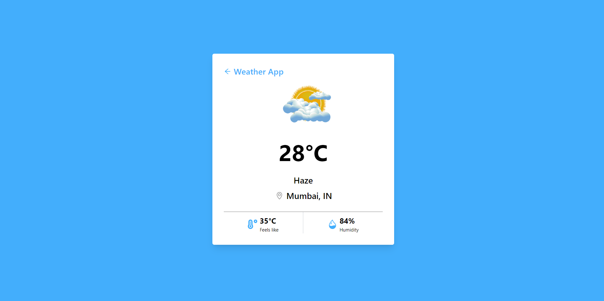

# Weather App - HootBoard

Stay prepared for any weather with our Weather App! Get real-time weather updates for any city worldwide or simply click a button to fetch the weather at your current location. With a clean and intuitive interface, you can easily plan your day ahead with accurate weather forecasts

## Deployed Link

[Link](https://weather-app-chi-steel.vercel.app/weather)

## Technologies

The project uses the following technologies and frameworks:

- HTML
- CSS
- Javascript
- React.js
- TailwindCSS

## Installation

Provide instructions on how to install and set up your project locally. Include any prerequisites or dependencies required. For example:

1. Clone the repository: `https://github.com/ignitinsharma/weather_app.git`
2. Install dependencies: `npm install`
3. Start the development server: `npm run dev`

## Features

-Weather App: A weather application that allows you to check the weather for different cities and also fetches the weather for your current location.

-Search Weather: Enter a city name in the input box to get the current weather details for that city.

-Current Location Weather: Click the "Get Current Location" button to fetch the weather details based on your current geolocation.

-Interactive UI: Clean and user-friendly interface with a responsive design for seamless usage on various devices.

-Geolocation Support: Checks for browser geolocation support to fetch weather based on user's current location.

## Screenshots

- Home Page \*

- Weather Page \*

